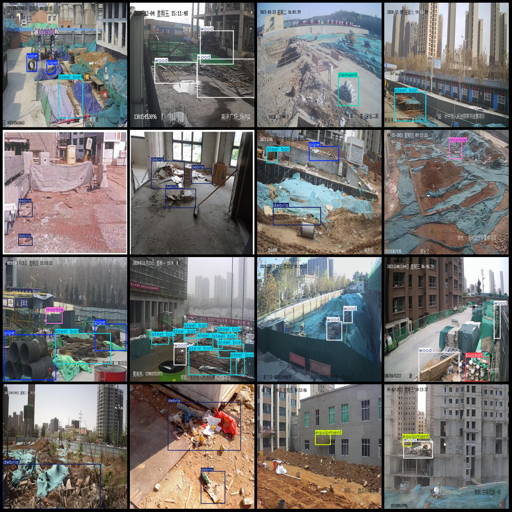
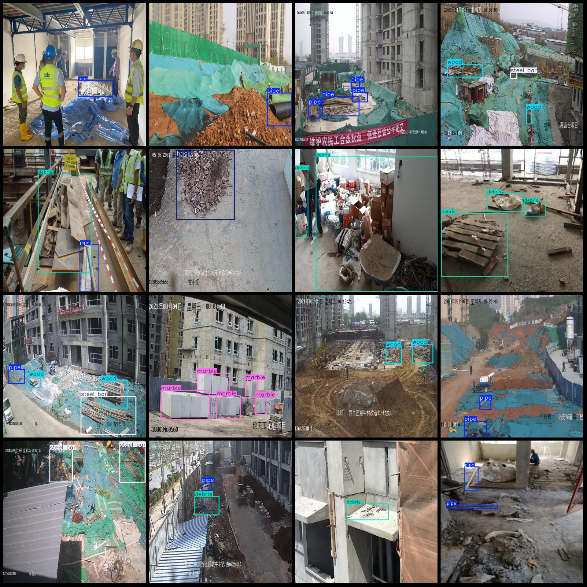

# Building Materials Detection Data Set for Construction Sites - VOC+YOLO-formatted dataset with 405 images in 11 categories

dataset format: Pascal VOC format+YOLO format
number of images: 405  
annotation count: 405  
annotation count: 405  
annotationnumber of classes: 11  
annotation class names:["box","brick","bucket","cement","debris","equipment","marble","pipe","rebar","steel bar","wood"]
boxes per class:   
box box count = 26
brick box count = 13
bucket box count = 6
cement box count = 14
debris box count = 185
equipment box count = 69
marble box count = 97
pipe box count = 157
The number of rebar (steel bars) = 67
Steel bar Frame Count = 155
Wood frame count = 223
total boxes: 1012  
Image resolution: Multi-resolution, 512x512, 640x640, etc.
Using annotation tool: labelImg
Annotation rules: Draw a rectangle box for the class
Important notes: None
Special statement: This dataset does not guarantee the precision of the trained model or weight files.
## Images

Here is a pay link on Stripe ( https://buy.stripe.com/3cs8yP7sY87d0vu9AB ). Please contact me lonlonago@foxmail.com after funding $89, and I will send you a complete data files , thank you!

